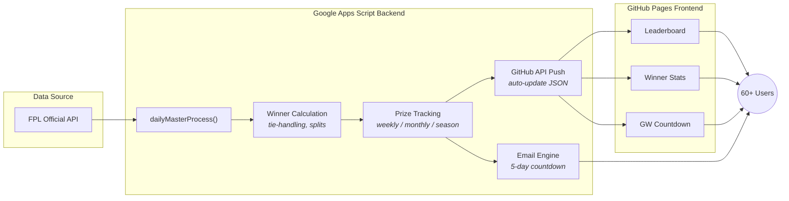

[](https://adigunners.github.io/)      

# Fantasy Mini-League Management (FML)

**Automated fantasy football mini-league management system serving 60+ IIM Mumbai alumni with live leaderboards, scoring, and email campaigns.**

What started as a Google Sheet became a production system: one-click daily processing, tie-handling algorithms, personalized email campaigns with 5-day countdown escalation, and a PWA that 60+ users rely on every gameweek. This project demonstrates full product ownership — from requirements gathering with real users to automated deployment serving a live audience.

## Key Metrics

| Metric | Value | Metric | Value |
|---|---|---|---|
| Active users | 60+ | Gameweeks per season | 38 |
| Prize pool entry fee | INR 3,000/player | Email campaigns | 5-day countdown |
| Frontend JS modules | 14 | Data files (live + historical) | 70+ JSON |

## Architecture



## Features

**One-Click Processing** — `dailyMasterProcess()` fetches FPL scores, calculates winners, updates prize tracking, and pushes website data in a single invocation

**Smart Winner Calculation** — Handles ties with automatic prize splitting, tracks weekly and monthly winners, and maintains season-long leaderboard rankings

**5-Day Email Campaigns** — Escalating countdown emails with personalized greetings, "6 HOURS REMAINING" Day 0 urgency with blinking animation, mobile-responsive HTML templates

**Live PWA** — Service worker caching, offline support, real-time gameweek countdown, paginated leaderboards with historical gameweek data

**Automated Deployment** — Google Apps Script pushes updated JSON to GitHub via API, GitHub Pages serves instantly — zero manual deployment steps

**Test Mode** — Full demo environment with realistic data at `?test=true`, safe testing that never touches live data, admin-only email delivery for QA

## Getting Started

### For Users

Visit the **[live leaderboard](https://adigunners.github.io/)** or try the **[demo with test data](https://adigunners.github.io/?test=true)**.

### For Developers

```bash
git clone https://github.com/adigunners/adigunners.github.io.git
cd adigunners.github.io
npm install
npm run build
```

Open `index.html` in a browser. Append `?test=true` for demo data.

### Admin Functions (Google Apps Script)

```javascript
dailyMasterProcess();         // Daily league processing
manualUpdateWinnerStats();    // Force winner stats refresh
testEmailSending();           // Test email to admin only
```

---

<details>
<summary><b>System Architecture</b></summary>

### Backend: Google Apps Script

The backend runs as a Google Apps Script project attached to a Google Sheet that serves as the database. Key components:

- **Daily Trigger** — `dailyMasterProcess()` runs on a time-driven trigger, fetching live data from the FPL API
- **Winner Calculation** — Compares gameweek scores across all players, handles ties with prize-splitting logic
- **Prize Tracking** — Maintains running totals for weekly, monthly, and season prizes with payment status
- **GitHub Integration** — Pushes updated JSON files (`league_stats.json`, `winner_stats.json`, `next_deadline.json`, `prizes.json`) directly to this repo via GitHub API using a Personal Access Token

### Frontend: GitHub Pages

A static PWA built with vanilla JavaScript (no framework), structured as 14 ES6 modules:

| Module | Purpose |
|---|---|
| `ui-manager.js` | Main UI orchestration |
| `data-loader.js` | JSON data fetching with caching |
| `countdown.js` | Gameweek countdown timer |
| `winners-module.js` | Winner display and pagination |
| `leaderboard-enhancement.js` | Leaderboard features |
| `prize-structure.js` | Prize calculations |
| `state-module.js` | Application state management |
| `error-handler.js` | Error handling and recovery |
| `service-worker.js` | PWA caching and offline support |

### Data Flow

```
FPL API → Google Sheets (database)
       → Google Apps Script (processing)
       → GitHub API (JSON push)
       → GitHub Pages (static site)
       → 60+ users (PWA)
```

</details>

<details>
<summary><b>Email Campaign System</b></summary>

### 5-Day Countdown Escalation

The registration deadline email campaign sends personalized messages with increasing urgency:

| Day | Subject Tone | Key Element |
|---|---|---|
| Day 5 | Friendly reminder | League details, prize structure |
| Day 4 | Gentle nudge | Current registration count |
| Day 3 | Mid-campaign push | Testimonials, FOMO elements |
| Day 2 | Urgency ramp | "2 days left" prominent |
| Day 1 | Last chance | "FINAL DAY" banner |
| Day 0 | Deadline day | "6 HOURS REMAINING" with blinking animation |

All emails use:
- Smart name personalization (handles compound names, formal/informal)
- Mobile-responsive HTML templates with FPL branding
- Professional styling with official FPL color scheme
- Admin-only test delivery mode for QA

</details>

<details>
<summary><b>Prize Structure</b></summary>

| Prize Type | Frequency | Awards |
|---|---|---|
| Weekly | Every gameweek (38/season) | 1st and 2nd place |
| Monthly | Every calendar month | 1st and 2nd place |
| Season | End of season | Top 10 share remaining pool |

- Entry fee: INR 3,000 per player
- All calculations automated with tie-handling (prize splitting)
- Payment status tracked per winner in admin dashboard

</details>

<details>
<summary><b>Testing & Demo</b></summary>

### Test Mode

Append `?test=true` to any page URL to load demo data without affecting live state.

```
https://adigunners.github.io/?test=true
https://adigunners.github.io/winners.html?test=true
```

### Additional Query Parameters

| Parameter | Purpose |
|---|---|
| `?test=true` | Load test/demo data |
| `?clockOffset=<ms>` | Shift countdown clock for testing |
| `?dl=<timestamp>` | Override next deadline |
| `?gw=<number>` | Override current gameweek |

### Admin Testing

```javascript
setupCompleteTestDemo();      // Create full test environment
checkTestDataStatus();        // Verify test data integrity
cleanupTestDataDirect();      // Remove all test data
testEmailSending();           // Send test email to admin only
```

</details>

<details>
<summary><b>Tech Stack</b></summary>

| Layer | Technology | Purpose |
|---|---|---|
| Backend | Google Apps Script | Processing, API integration, email |
| Database | Google Sheets | Player data, scores, winners, settings |
| Frontend | HTML5 / CSS3 / ES6+ | 14 modular JS files, BEM methodology |
| Hosting | GitHub Pages | Static site serving |
| PWA | Service Worker | Offline support, caching |
| Email | Gmail API | Personalized HTML email campaigns |
| Data | FPL Official API | Live scores and gameweek data |
| Deployment | GitHub API | Automated JSON updates from Apps Script |
| Fonts | Poppins (woff2) | Typography |
| Code Quality | Prettier, markdownlint, Husky | Formatting and linting |
| CI/CD | GitHub Actions | Automated checks |

</details>

<details>
<summary><b>Project Structure</b></summary>

```
adigunners.github.io/
├── index.html                  # Main leaderboard page
├── winners.html                # Winner rankings page
├── service-worker.js           # PWA service worker
├── CNAME                       # Custom domain config
│
├── css/
│   └── styles.css              # BEM methodology stylesheet
│
├── js/                         # 14 ES6 modules
│   ├── ui-manager.js           # Main UI orchestration
│   ├── data-loader.js          # Data fetching + caching
│   ├── countdown.js            # Gameweek countdown
│   ├── winners-module.js       # Winner display
│   ├── leaderboard-enhancement.js
│   ├── prize-structure.js
│   ├── state-module.js
│   ├── error-handler.js
│   └── ...
│
├── data/                       # Auto-generated JSON
│   ├── league_stats.json       # Player count, pot, last updated
│   ├── winner_stats.json       # Complete rankings (49KB)
│   ├── next_deadline.json      # Countdown target
│   ├── prizes.json             # Prize structure
│   ├── history/                # GW1-GW23 snapshots
│   └── test_history/           # GW1-GW38 test data
│
├── assets/
│   ├── fonts/                  # Poppins woff2
│   ├── images/                 # Logos (IIM, FPL)
│   └── twemoji/                # Emoji SVGs
│
├── docs/                       # Documentation
│   ├── CHANGELOG.md
│   ├── SETUP_GUIDE.md
│   └── development/            # CSS guides, BEM reference
│
├── tests/                      # Test suites
│   ├── unit/
│   ├── integration/
│   └── manual/
│
├── scripts/                    # Build tools
│   ├── build.js
│   └── set-version.js
│
└── .github/
    └── workflows/              # CI/CD pipelines
```

</details>

---

Built with [Claude Code](https://claude.ai/claude-code) as the primary development partner.

Version 1.0.6 | [Live Site](https://adigunners.github.io/) | [Demo](https://adigunners.github.io/?test=true) | [Winner Leaderboard](https://adigunners.github.io/winners.html)

MIT License — see [LICENSE](LICENSE) file.
